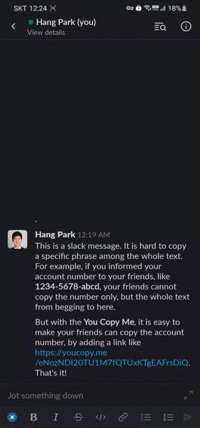

# You Copy Me

>  **https://youcopy.me**

**You Copy Me** helps users to copy text into their clipboard with just one simple click (touch).

Together with **You Copy Me**, you can make a link for your text and share the link with others, thereby helps them to copy your text easily.

## Why You Copy Me?

Some mobile apps, and even some web pages, refrain users from copying text. Or some apps just offer hyperlinks for URLs, while makes it too difficult to select a specific phrase from the whole text. You Copy Me helps people to copy specific phrase super easily.

## Acknowledgements

- Logo & Favicon: based from [FontAwesome ](https://fontawesome.com/license)
- Site theme: [Minty from Bootswatch](https://bootswatch.com/) based on [Bootstrap5](https://getbootstrap.com/)
- Development: by [React](https://reactjs.org/) with [create-react-app](https://github.com/facebook/create-react-app)
- Deployment: GitHub pages by [gh-pages](https://github.com/tschaub/gh-pages)
